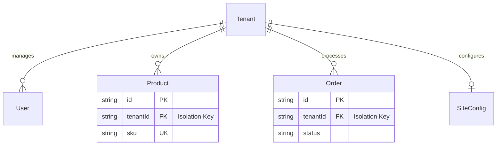
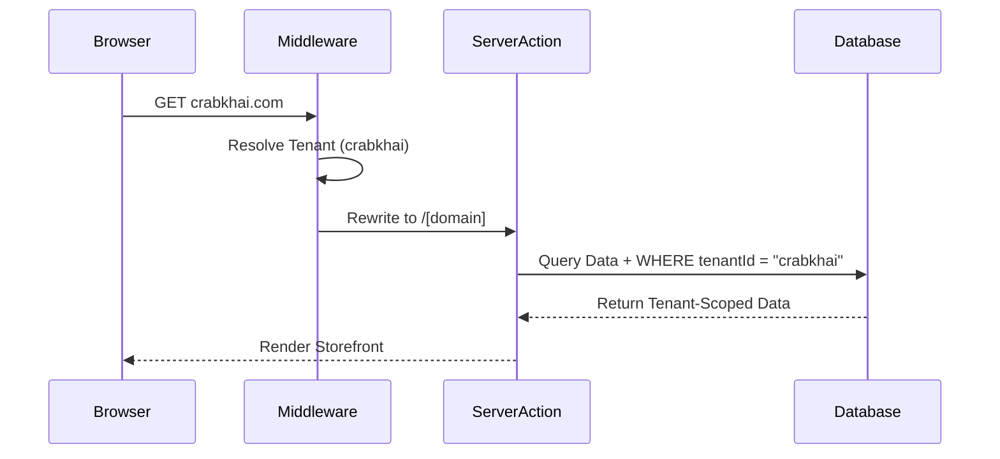

# Software Requirements Specification (SRS)
**Project Name:** Crab & Khai - Omnichannel E-Commerce Platform
**Version:** 2.0.0
**Last Updated:** 2026-01-31

---

## 1. Introduction

### 1.1 Purpose
The purpose of this document is to define the software requirements for the **Crab & Khai** platform, a high-performance, multi-tenant e-commerce solution. It outlines the architectural design, functional capabilities, security protocols, and performance standards required to support multiple storefronts (tenants) from a single code base.

### 1.2 Scope
The system is a "Multi-Instance" e-commerce application built on Next.js 15. It encompasses:
*   **Customer Storefront**: Product browsing, cart management, checkout, and order tracking.
*   **Admin Dashboard**: Inventory management, order processing, analytics, and security controls.
*   **Tenant Management**: Support for custom domains and subdomains with strict data isolation.
*   **Infrastructure**: Serverless deployment (Vercel), distributed database (Prisma Accelerate), and edge caching.

---

## 2. System Architecture

### 2.1 Multitenancy Model
The platform employs a **Logical Multitenancy** model enforced at the application and database layers.

### 2.2 Data Isolation Flow
Requests are routed and filtered based on the incoming hostname, ensuring strict data segregation.

---

## 3. Functional Requirements

### 3.1 Caching & Performance
**Goal**: Sub-second response times (< 200ms TTFB) and high scalability.

*   **FR-01: Multi-Layer Caching**
    *   **L1 Database**: Prisma Accelerate handles connection pooling and query result caching at the edge.
    *   **L2 Application**: Next.js Data Cache (`unstable_cache`) memoizes expensive computations (e.g., specific product sections).
    *   **L3 TLS/Edge**: Static assets and ISR pages are cached at the CDN edge (Vercel Edge Network).

*   **FR-02: Tag-Based Invalidation**
    *   System must use `revalidateTag` to purge stale data instantly upon admin updates (e.g., changing a product price instantly updates the storefront).

*   **FR-03: Optimization**
    *   **Payload Reduction**: API responses for list views (Home, Menu) must exclude large fields (descriptions, metadata) to prevent exceeding serverless payload limits (2MB).
    *   **Auto-Scroll Removal**: Carousel interactions must be seamless without interfering with vertical page scrolling.

### 3.2 Security & Access Control
**Goal**: Zero-trust security model for administrative actions.

*   **FR-04: Trusted Device Enforcement**
    *   **Middleware Guard**: All routes under `/admin` must verify a valid `trusted_device` cookie.
    *   **Device Authorization**: New devices must be authorized via a rotating `ADMIN_SETUP_SECRET`.
    *   **Force Redirect**: Unauthorized access attempts must be redirected to `/admin/security/device-setup` regardless of authentication status.

*   **FR-05: Session Management**
    *   Authentication via NextAuth.js v5.
    *   Admins must be re-verified against the database periodically (Session + Device Trust).

### 3.3 Automation & Self-Healing
**Goal**: Minimize manual configuration for new deployments.

*   **FR-06: Auto-Seeding**
    *   Upon first access to the Homepage, the system must detect missing configuration (e.g., missing Product Sections).
    *   If missing, it must automatically provision default sections ("Best Sellers", "New Arrivals") and populate them with available products.

---

## 4. Non-Functional Requirements

### 4.1 Scalability
*   **Horizontal Scaling**: The codebase is stateless, allowing essentially infinite horizontal scaling via serverless functions.
*   **Database**: Designed to support 100+ active tenants via connection pooling.

### 4.2 Reliability
*   **Uptime**: 99.9% uptime target.
*   **Self-Correction**: Auto-seeding ensures the application recovers from empty-state configurations without downtime.

### 4.3 Compliance
*   **Audit Logging**: Critical actions (Price changes, Security authorization) are logged to `SecurityLog` and `AuditLog` tables.
*   **Data Privacy**: Customer PII (Phone, Address) is stored securely and accessible only to authorized tenant admins.

---

## 5. Technology Stack

| Component | Technology | Rationale |
|-----------|------------|-----------|
| **Frontend** | Next.js 15 (App Router) | SEO, Server Components, Streaming |
| **Backend** | Server Actions | Type-safety, Direct DB access |
| **Database** | PostgreSQL | Relational integrity for Orders/Inventory |
| **ORM** | Prisma & Accelerate | Type-safety, Caching, Pooling |
| **Auth** | NextAuth.js v5 | Standardized, Secure |
| **Styling** | TailwindCSS + Shadcn/UI | Rapid development, Accessibility |
| **Media** | Cloudinary | Auto-optimization (WebP), Tenant Folders |

---

## 6. Deployment Strategy
*   **Platform**: Vercel
*   **CI/CD**: Git-based deployments.
*   **Environment Variables**: Strict separation of secrets (Database URL, API Keys).

