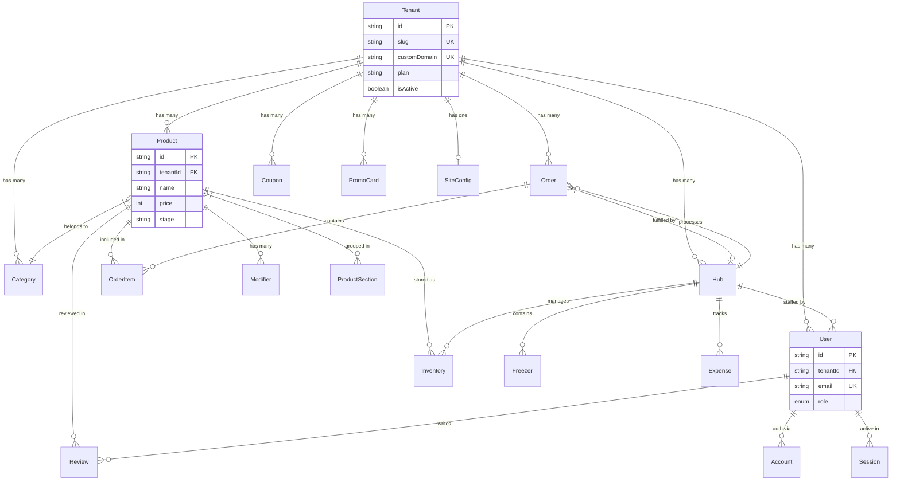
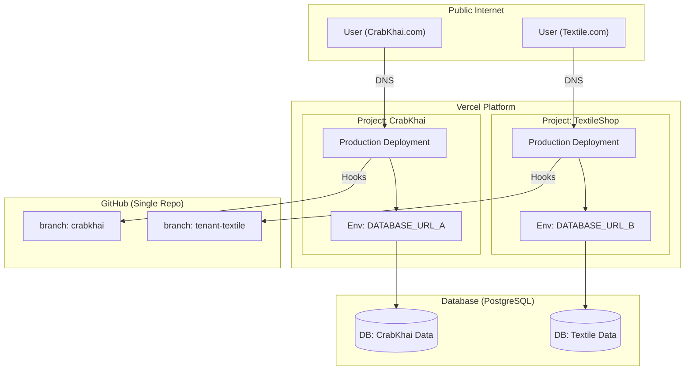
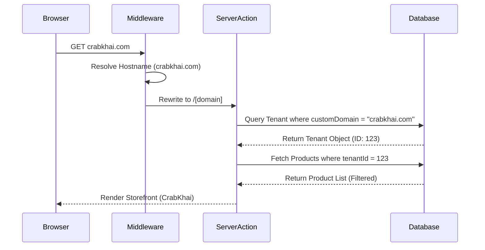

# System Design

This document details the architectural decisions and data structures that enable the Multi-Tenant/Multi-Instance capabilities of the **CrabKhai** platform.

## 1. Entity Relationship Diagram (ERD)

The following diagram illustrates how the `Tenant` entity acts as the root for all client-specific data.



## 2. Hosting & Deployment Architecture

We use a **Multi-Instance** approach on Vercel to optimize for isolation and performance on the free tier.



## 3. Data Isolation Flow

The system ensures that a request to a specific domain only sees data belonging to that tenant.



## 4. Cross-Tenant Security Architecture

The platform employs a multi-layered security model to ensure that Tenant A can never access or modify data belonging to Tenant B.

### JWT & Session Scoping
We utilize **NextAuth.js** with a customized JWT-based session strategy:
- **Tenant Context in JWT**: Upon login, the user's `tenantId` is encoded into the JWT payload.
- **Session Scoping**: The `session()` callback ensures `tenantId` is available in all Server Components and Server Actions.
- **Role-Based Access (RBAC)**: Middleware and API routes check both `role` (SUPER_ADMIN vs. HUB_ADMIN) and `tenantId` match before allowing data access.

### Database Constraint Isolation
Every data-fetching Server Action is "Hardened" with a mandatory `tenantId` clause:
```typescript
// Example of a hardened query
const products = await prisma.product.findMany({
    where: { tenantId: session.user.tenantId } 
});
```
This ensures that even if a user manually changes an ID in a request, the query is geographically locked to their authenticated tenant.

---

## 5. Asset & Media Isolation (Cloudinary)

To maintain privacy and organizational clarity, the platform uses **Folder Partitioning** for all uploaded media assets.

### Dynamic Folder Routing
When an image is uploaded (via `ImageUpload.tsx` or `MediaUpload.tsx`), the system routes it to a specific Cloudinary folder based on the tenant's identifier:
- **Structure**: `platform_uploads/[tenant_slug]/[resource_type]/`
- **Isolation**: Each tenant has a dedicated "sandbox" within Cloudinary. This prevents asset naming collisions and allows for tenant-specific storage reporting or bulk-deletion.

### Fallback Data URLs
In cases where Cloudinary is not configured, the system utilizes **Base64 Inline Storage**. While not recommended for high-volume use, it maintains 100% tenant isolation as the data strings are stored directly in the tenant-scoped database records.

---

## 6. Multi-Tenant Caching Strategy

The platform uses Next.js **Data Cache** (`unstable_cache`) to ensure high performance without compromising data isolation.

### Tenant-Scoped Tags
To prevent "Cache Injection" (where Tenant A sees cached data from Tenant B), all cache keys are tagged with the specific `tenantId`:
- **Implementation**: `tags: ['products', tenantId]`
- **Isolation**: When a product is updated in the CrabKhai admin, we only invalidate tags for `['products', crabkhaiId]`. The cache for Textile remains untouched and secure.

### Revalidation Flow
- **On-Demand**: Triggered via `revalidateTag()` when a specific resource (Order, Category, Product) is modified.
- **Time-Based**: Fallback TTL (e.g., 3600s) ensures data eventually refreshes even if hardware signals fail.

---

## 7. Future Scaling Roadmap (100+ Tenants)

While the current **Multi-Instance (Vercel Project-per-Client)** model works perfectly for the first 10-20 clients, the platform is designed to scale to hundreds of tenants via the following path:

### Phase 1: High-Density Logical Multi-Tenancy
Move from separate Vercel projects to a single project that utilizes a **Centralized Database** with a sophisticated `tenantId` filtering layer (Row Level Security or Prisma Middleware).

### Phase 2: Schema Isolation
As data grows, transition to **PostgreSQL Schema Isolation**:
- **Setup**: Each tenant gets their own private schema within a shared database instance (`crabkhai.products`, `textile.products`).
- **Benefit**: Provides the data isolation of separate databases with the management ease of a single database.

### Phase 3: Global Edge Performance
Deploying **Edge Middleware** and **Edge Config** to resolve tenant domains at the CDN level, reducing the time-to-first-byte (TTFB) to near-zero across the globe.

---

## 8. Why this Design?


| Feature | Single Project (Multi-Tenant) | Separate Projects (Multi-Instance) |
|---------|-------------------------------|-----------------------------------|
| **Isolation** | Logical (Risky if filters missing) | Physical (Safe, unique projects) |
| **Env Vars** | Shared (Must prefix keys) | Unique (Clean, one key per project) |
| **Themes** | Conditional Code | Branch-specific Code |
| **Vercel Free** | Hits limits faster | Distributes limits across projects |
