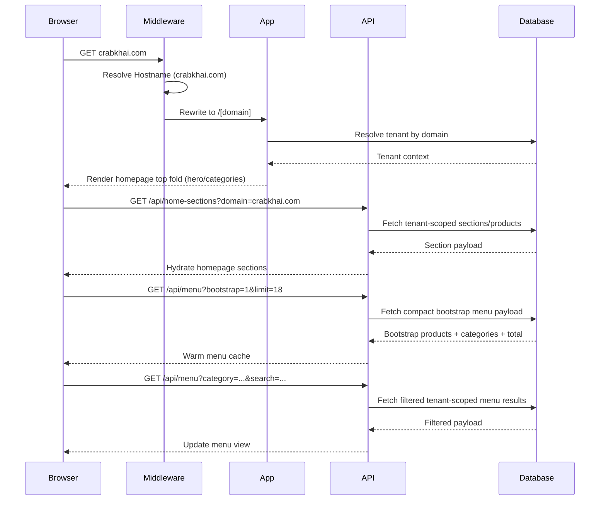

# System Design

This document describes the local-only Super Admin control plane and the tenant-only production deployments. The Super Admin lives at `app.localhost` and is never exposed in production.

## 1. Entity Relationship Diagram (ERD)

The tenant app uses the `Tenant` entity as the root for client-specific data. The control-plane uses `TenantRegistry` and `PlanCatalog` in a separate database.

```mermaid
erDiagram
    TenantRegistry {
        string id PK
        string slug UK
        string primaryDomain UK
        string planSlug
        string status
    }

    PlanCatalog {
        string id PK
        string slug UK
        string name
        float price
        json features
    }

    ProvisioningJob {
        string id PK
        string tenantId
        string status
    }

    TenantRegistry ||--o{ ProvisioningJob : "tracks" }

    Tenant ||--o{ User : "has many"
    Tenant ||--o{ Product : "has many"
    Tenant ||--o{ Order : "has many"
    Tenant ||--o{ Category : "has many"
    Tenant ||--o{ Hub : "has many"
    Tenant ||--o{ Coupon : "has many"
    Tenant ||--o{ PromoCard : "has many"
    Tenant ||--o| SiteConfig : "has one"

    Product ||--o{ OrderItem : "included in"
    Product ||--o{ Modifier : "has many"
    Product ||--o{ Inventory : "stored as"
    Product ||--o{ Review : "reviewed in"
    Product }|--|| Category : "belongs to"
    Product }|--o{ ProductSection : "grouped in"

    Order ||--o{ OrderItem : "contains"
    Order }|--o| Hub : "fulfilled by"

    Hub ||--o{ Freezer : "contains"
    Hub ||--o{ Inventory : "manages"
    Hub ||--o{ Expense : "tracks"
    Hub ||--o{ Order : "processes"
    Hub ||--o{ User : "staffed by"

    User ||--o{ Review : "writes"
    User ||--o{ Account : "auth via"
    User ||--o{ Session : "active in"

    Tenant {
        string id PK
        string slug UK
        string customDomain UK
        string plan
        boolean isActive
    }

    Product {
        string id PK
        string tenantId FK
        string name
        int price
        string stage
    }

    User {
        string id PK
        string tenantId FK
        string email UK
        enum role
    }
```

## 2. Hosting & Deployment Architecture

We use a **control-plane + tenant-only** model:

- **Control plane**: local-only Super Admin with its own DB (`PLATFORM_DATABASE_URL`).
- **Tenant production**: tenant-facing app on custom domain, tenant-scoped data in tenant DB (`DATABASE_URL`), and edge caching in front of app routes/APIs.

```mermaid
flowchart TD
    subgraph LocalPlatform[Local Platform (localhost only)]
        SA[Super Admin UI
app.localhost] --> APIGW[Platform Auth
/api/platform-auth]
        APIGW --> PDB[(Control-Plane DB
PLATFORM_DATABASE_URL)]
        SA --> CP[Control-Plane Actions]
        CP --> PDB
        CP --> REG[Tenant Registry + Plan Catalog]
    end

    subgraph TenantProd[Tenant Production Deployment]
        TB[Browser] --> TD[tenant-domain.com]
        TD --> EDGE[Edge / CDN Cache]
        EDGE --> APP[Tenant App
    DEPLOYMENT_MODE=tenant]
        APP --> TDB[(Tenant DB
DATABASE_URL)]
    end

    REG -->|Provisioning Bundle| Provision[Provisioning Script]
    Provision --> TDB
    Provision --> Deploy[Deploy Tenant App]
    Deploy --> TenantProd
```

## 3. Data Isolation Flow

All tenant production deployments are single-tenant. Each domain resolves to one tenant context, and data access is constrained by tenant identity.

Current runtime behavior has two important storefront flows:

1. Homepage top fold renders first, sections are fetched after paint via API.
2. Menu uses bootstrap/filtered/full API modes depending on request params.



## 4. Cross-Tenant Security Architecture

In production, isolation is physical (one DB per tenant). In local development, tenant data is isolated by `tenantId` filtering.

### JWT & Session Scoping

We utilize **NextAuth.js** with a customized JWT-based session strategy:

- **Tenant Context in JWT**: Upon login, the user's `tenantId` is encoded into the JWT payload.
- **Session Scoping**: The `session()` callback ensures `tenantId` is available in all Server Components and Server Actions.
- **Role-Based Access (RBAC)**: Middleware and API routes check both `role` (SUPER_ADMIN vs. HUB_ADMIN) and `tenantId` match before allowing data access.

### Database Constraint Isolation

Every data-fetching Server Action is "Hardened" with a mandatory `tenantId` clause:

```typescript
// Example of a hardened query
const products = await prisma.product.findMany({
  where: { tenantId: session.user.tenantId },
});
```

This ensures that even if a user manually changes an ID in a request, the query is geographically locked to their authenticated tenant.

---

## 5. Asset & Media Isolation (VPS Media Storage)

To maintain privacy and organizational clarity, the platform uses **Folder Partitioning** for all uploaded media assets, stored directly on the VPS filesystem.

### Dynamic Folder Routing

When an image is uploaded (via `ImageUpload.tsx`), the system processes it through Sharp (server-side) and stores optimized variants on disk under `/data/media/`:

- **Structure**: `/data/media/tenants/[tenant_slug]/[resource_type]/[year]/[month]/[uuid]/`
- **Variants**: Each upload generates 6 WebP variants — `original.webp`, `card.webp`, `hero.webp`, `full.webp`, `thumb.webp`, `lqip.webp`.
- **Isolation**: Each tenant has a dedicated directory tree. This prevents asset naming collisions and allows for tenant-specific storage reporting or bulk-deletion.
- **Serving**: Images are served via the `/media/[...path]` API route with immutable cache headers (`max-age=31536000`).

### Legacy Cloudinary Backward Compatibility

The client-side media helper (`lib/media.ts`) detects legacy Cloudinary URLs still stored in the database and applies Cloudinary transformations for those. For VPS-hosted images (URLs starting with `/media/`), it rewrites the URL to the appropriate pre-generated variant.

---

## 6. Multi-Tenant Caching Strategy

The platform uses layered caching to keep tenant data isolated while reducing repeated work.

### 6.1 Server data cache (`unstable_cache`)

Examples in current code:

1. `getHomeSections` (`app/actions/section.ts`) with revalidate `60`.
2. `getCachedMenuData` (`app/actions/menu.ts`) with revalidate `600`.
3. `getCachedMenuBootstrapProducts` (`app/actions/menu.ts`) with revalidate `60`.
4. `getCachedMenuBootstrapTotal` (`app/actions/menu.ts`) with revalidate `300`.

Tenant isolation is preserved by tenant-aware query filters and domain-to-tenant resolution, not by cross-tenant shared payload reuse.

### 6.2 API cache headers

Current API header behavior:

1. `/api/menu` bootstrap: `public, s-maxage=60, stale-while-revalidate=300`
2. `/api/menu` filtered: `public, s-maxage=30, stale-while-revalidate=120`
3. `/api/menu` full: `public, s-maxage=60, stale-while-revalidate=600`
4. `/api/home-sections`: `public, s-maxage=60, stale-while-revalidate=300`

### 6.3 HTML route cache headers

Configured in `next.config.ts`:

1. `/`: `public, s-maxage=60, stale-while-revalidate=300`
2. `/menu`: `public, s-maxage=60, stale-while-revalidate=300`

### 6.4 Client warm cache

`ResourcePrefetcher` warms menu bootstrap payload after page load + idle and stores it in session cache + Zustand for fast route transitions.

### Revalidation policy

1. On-demand invalidation is used where write actions update tags/paths.
2. Time-based revalidation remains the fallback safety net.

---

## 7. Future Scaling Roadmap (100+ Tenants)

While the current **tenant-only production** model works for early clients, the platform can evolve to centralized multitenancy if needed.

### Phase 1: High-Density Logical Multi-Tenancy

Move from separate Vercel projects to a single project that utilizes a **Centralized Database** with a sophisticated `tenantId` filtering layer (Row Level Security or Prisma Middleware).

### Phase 2: Schema Isolation

As data grows, transition to **PostgreSQL Schema Isolation**:

- **Setup**: Each tenant gets their own private schema within a shared database instance (`crabkhai.products`, `textile.products`).
- **Benefit**: Provides the data isolation of separate databases with the management ease of a single database.

### Phase 3: Global Edge Performance

Deploying **Edge Middleware** and **Edge Config** to resolve tenant domains at the CDN level, reducing the time-to-first-byte (TTFB) to near-zero across the globe.

---

## 8. Why this Design?

| Feature         | Single Project (Multi-Tenant)      | Separate Projects (Multi-Instance)  |
| --------------- | ---------------------------------- | ----------------------------------- |
| **Isolation**   | Logical (Risky if filters missing) | Physical (Safe, unique projects)    |
| **Env Vars**    | Shared (Must prefix keys)          | Unique (Clean, one key per project) |
| **Themes**      | Conditional Code                   | Branch-specific Code                |
| **Vercel Free** | Hits limits faster                 | Distributes limits across projects  |

## 9. Local Platform-Only Notes

- Super Admin runs only on `app.localhost` with hosts file entry.
- Super Admin uses the control-plane DB (`PLATFORM_DATABASE_URL`).
- Production tenant deployments use `DEPLOYMENT_MODE=tenant` and never expose `/app`.
- Plans are centralized in the control-plane and snapshotted into tenant DBs at provisioning time.

## 10. Migration Validation Policy

- Before any real tenant migration, validate in a **clone DB**.
- Always **backup -> migrate -> restore** the clone.
- Only after validation, migrate the real tenant DB.
