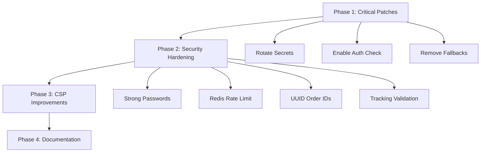

# Security Remediation Plan

## Executive Summary
This plan addresses critical and high-severity security vulnerabilities identified in the code review. Priority should be given to items marked CRITICAL.

---

## Phase 1: Critical Security Patches (Immediate - Within 24 Hours)

### 1.1 Rotate All Exposed Secrets
**Severity:** CRITICAL  
**Files:** `.env`  
**Estimated Effort:** 1 hour

**Tasks:**
- [ ] Rotate Prisma Accelerate API key via Prisma Dashboard
- [ ] Generate new Google OAuth credentials via Google Cloud Console
- [ ] Generate new Vercel Auth Token via Vercel Dashboard
- [ ] Generate new Gemini API Key via Google AI Studio
- [ ] Add `.env` to `.gitignore` if not already present
- [ ] Commit removal of `.env` from repository tracking
- [ ] Add environment variables to Vercel project settings

**Verification:**
- Confirm `.env` is not tracked in git
- Verify all secrets are only in Vercel Environment Variables

### 1.2 Enable Super Admin Authorization Check
**Severity:** CRITICAL  
**File:** [`app/actions/super-admin.ts:16-19`](app/actions/super-admin.ts:16)  
**Estimated Effort:** 15 minutes

**Current Code:**
```typescript
if ((session?.user as any)?.role !== 'SUPER_ADMIN') {
    // throw new Error("Unauthorized: Super Admin access required");
    // Allowing for dev/demo purposes if role missing in some mocks,
}
```

**Required Change:**
```typescript
if ((session?.user as any)?.role !== 'SUPER_ADMIN') {
    throw new Error("Unauthorized: Super Admin access required");
}
```

**Tasks:**
- [ ] Uncomment the authorization throw statement
- [ ] Remove the commented explanation
- [ ] Test with non-admin user account

### 1.3 Remove Hardcoded Fallback Secrets
**Severity:** HIGH  
**Files:** [`app/actions/admin-helper.ts:22`](app/actions/admin-helper.ts:22), [`app/actions/security.ts:7`](app/actions/security.ts:7)  
**Estimated Effort:** 30 minutes

**Current Code (admin-helper.ts:22):**
```typescript
return config?.adminSetupToken || process.env.ADMIN_SETUP_SECRET || "crab-secret-setup-123";
```

**Current Code (security.ts:7):**
```typescript
const SETUP_SECRET = process.env.ADMIN_SETUP_SECRET || "crab-secret-setup-123";
```

**Required Change:**
```typescript
// admin-helper.ts
const token = config?.adminSetupToken || process.env.ADMIN_SETUP_SECRET;
if (!token) {
    throw new Error("ADMIN_SETUP_SECRET environment variable is required");
}
return token;

// security.ts
const SETUP_SECRET = process.env.ADMIN_SETUP_SECRET;
if (!SETUP_SECRET) {
    throw new Error("ADMIN_SETUP_SECRET environment variable is required");
}
```

**Tasks:**
- [ ] Add environment variable validation in both files
- [ ] Add startup validation script to check required secrets
- [ ] Document required environment variables in `ENV_SETUP.md`

---

## Phase 2: Security Hardening (Within 1 Week)

### 2.1 Implement Strong Default Password Generation
**Severity:** HIGH  
**File:** [`app/actions/user.ts:65`](app/actions/user.ts:65)  
**Estimated Effort:** 1 hour

**Current Code:**
```typescript
const hashedPassword = await bcrypt.hash(data.password || '123456', 10);
```

**Required Change:**
```typescript
import { randomBytes } from 'crypto';

// Generate secure random password
const passwordToHash = data.password || randomBytes(16).toString('hex');
const hashedPassword = await bcrypt.hash(passwordToHash, 12);
```

**Tasks:**
- [ ] Import `randomBytes` from crypto module
- [ ] Replace hardcoded '123456' with generated password
- [ ] Log or return the generated password for admin to retrieve
- [ ] Add "must_change_password" flag to user creation

### 2.2 Replace In-Memory Rate Limiting with Redis
**Severity:** HIGH  
**Files:** [`lib/rate-limit.ts`](lib/rate-limit.ts), [`app/actions/hero.ts`](app/actions/hero.ts)  
**Estimated Effort:** 3 hours

**Implementation Approach:**
```typescript
// lib/redis-rate-limit.ts
import { Redis } from '@upstash/redis' // or ioredis

const redis = new Redis({
    url: process.env.UPSTASH_REDIS_REST_URL!,
    token: process.env.UPSTASH_REDIS_REST_TOKEN!,
});

export async function checkRateLimit(ipOrIdentifier: string, limit: number = 5, windowMs: number = 60000): Promise<boolean> {
    const key = `ratelimit:${ipOrIdentifier}`;
    const current = await redis.incr(key);

    if (current === 1) {
        await redis.expire(key, Math.ceil(windowMs / 1000));
    }

    return current <= limit;
}
```

**Tasks:**
- [ ] Set up Redis provider (Upstash, Redis Cloud, or self-hosted)
- [ ] Create `lib/redis-rate-limit.ts` with Redis-based implementation
- [ ] Update `lib/rate-limit.ts` to import from new file
- [ ] Add Redis environment variables to deployment

### 2.3 Replace Predictable Order IDs with UUIDs
**Severity:** MEDIUM  
**File:** [`app/actions/order.ts:34`](app/actions/order.ts:34)  
**Estimated Effort:** 30 minutes

**Current Code:**
```typescript
orderId: `ORD-${Date.now()}`,
```

**Required Change:**
```typescript
import { randomUUID } from 'crypto';

orderId: `ORD-${randomUUID().substring(0, 8).toUpperCase()}`,
```

**Tasks:**
- [ ] Import `randomUUID` from crypto
- [ ] Update order ID generation logic
- [ ] Update any order ID parsing logic to handle new format

### 2.4 Add Tracking API Validation
**Severity:** MEDIUM  
**Files:** [`lib/track.ts`](lib/track.ts), API route handler  
**Estimated Effort:** 2 hours

**Tasks:**
- [ ] Add rate limiting to `/api/track` endpoint
- [ ] Validate and sanitize event data input
- [ ] Add request body size limits
- [ ] Implement CAPTCHA verification for high-volume requests

---

## Phase 3: CSP and Content Security Improvements (Within 2 Weeks)

### 3.1 Refactor to Reduce Unsafe CSP Directives
**Severity:** LOW  
**File:** [`next.config.ts:59`](next.config.ts:59)  
**Estimated Effort:** 4-8 hours (iterative)

**Tasks:**
- [ ] Audit all inline scripts in the application
- [ ] Move inline scripts to external files with proper caching
- [ ] Implement nonce-based script loading for dynamic content
- [ ] Test thoroughly after each change
- [ ] Gradually remove `'unsafe-inline'` where possible

**Scripts to Refactor:**
- Any inline event handlers → move to external JS
- Inline script tags in components → use useEffect
- Dynamic script generation → use nonce-based approach

### 3.2 Implement CSP Reporting
**Severity:** LOW  
**Estimated Effort:** 2 hours

**Tasks:**
- [ ] Add CSP violation reporting endpoint
- [ ] Configure reporting-uri in CSP header
- [ ] Set up monitoring/logging for CSP violations

---

## Phase 4: Documentation and Process Improvements (Ongoing)

### 4.1 Update ENV_SETUP.md
**File:** [`ENV_SETUP.md`](ENV_SETUP.md)  
**Estimated Effort:** 1 hour

**Content to Add:**
- List all required environment variables
- Document which are optional with defaults
- Include links to where to obtain each secret
- Add security best practices section

### 4.2 Create Security Runbook
**Document:** `docs/security-runbook.md`  
**Estimated Effort:** 2 hours

**Content:**
- How to rotate each type of secret
- Incident response steps for credential compromise
- Monitoring dashboards for security events
- Emergency contact information

### 4.3 Add Pre-commit Hooks
**Estimated Effort:** 1 hour

**Tasks:**
- [ ] Add git hook to prevent `.env` commits
- [ ] Add secret scanning with tools like truffleHog or git-secrets
- [ ] Add Husky pre-commit hook configuration

---

## Implementation Order



---

## Estimated Total Effort

| Phase | Effort |
|-------|--------|
| Phase 1: Critical Patches | 2-4 hours |
| Phase 2: Security Hardening | 8-12 hours |
| Phase 3: CSP Improvements | 6-10 hours |
| Phase 4: Documentation | 4-5 hours |
| **Total** | **20-31 hours** |

---

## Success Criteria

- [ ] All CRITICAL and HIGH severity issues resolved
- [ ] No hardcoded secrets in repository
- [ ] All authorization checks enforced
- [ ] Rate limiting works across server restarts
- [ ] No predictable IDs in system
- [ ] Documentation is complete and accurate
- [ ] Security runbook created for incident response
