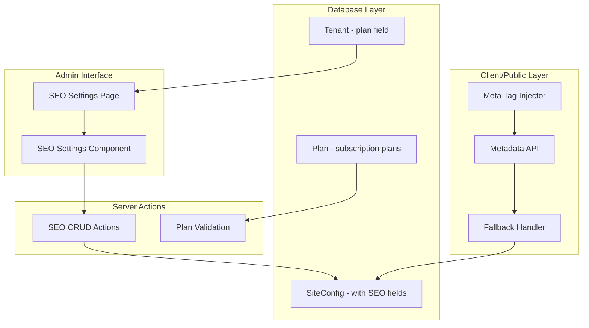

# Multi-Tenant SEO Implementation Plan

## Overview
Implement a comprehensive SEO management system that supports per-tenant (per-shop) SEO configuration with plan-based access control.

## Plan Structure (Existing)

| Plan | SEO Access Level | Notes |
|------|------------------|-------|
| **FREE** | ❌ No SEO | Default for new tenants |
| **BASIC** | ⚠️ Limited | Meta title/description only |
| **STANDARD** | ✅ Full | All SEO features |
| **PLATINUM** | ✅ Full + Priority | All features + priority support |

## Architecture Diagram



## 1. Database Schema Changes

### Update `SiteConfig` model with SEO fields

```prisma
model SiteConfig {
  // ... existing fields ...

  // SEO Fields
  metaTitle        String?  @default("Welcome to our shop")
  metaDescription  String?  @default("Order delicious food online")
  metaKeywords     String?  @default("")
  
  // Open Graph
  ogTitle          String?
  ogDescription    String?
  ogImage          String?
  ogType           String   @default("website")
  
  // Twitter Card
  twitterCard      String   @default("summary_large_image")
  twitterTitle     String?
  twitterDescription String?
  twitterImage     String?
  
  // Structured Data
  schemaType       String   @default("Restaurant")
  schemaJson       Json?
  
  // Technical SEO
  canonicalUrl     String?
  robotsContent    String   @default("index, follow")
  priority         Float    @default(0.5)
  changeFrequency  String   @default("weekly")
}
```

## 2. Plan-Based Access Control

### Update Plan Features to Include SEO

Update the `seedPlans` function in `app/actions/plans.ts` to include SEO features:

```typescript
const plans = [
    {
        slug: 'BASIC',
        name: 'Basic',
        price: 1000,
        features: [
            'Up to 1,000 Orders/mo',
            'Basic Analytics',
            'Email Support',
            '1 Admin User',
            'Basic SEO (Meta Title/Description)'
        ],
    },
    {
        slug: 'STANDARD',
        name: 'Standard',
        price: 3500,
        features: [
            'Up to 10,000 Orders/mo',
            'Advanced Analytics',
            'Priority Email Support',
            'Custom Domain',
            '5 Admin Users',
            'Full SEO (Meta, OG, Twitter, Structured Data)'
        ],
    },
    {
        slug: 'PLATINUM',
        name: 'Platinum',
        price: 8000,
        features: [
            'Unlimited Orders',
            'Real-time Analytics',
            '24/7 Phone Support',
            'Custom Domain & Branding',
            'Unlimited Admin Users',
            'Dedicated Account Manager',
            'Full SEO + Priority Indexing'
        ],
    }
];
```

### Plan Check Utility

```typescript
// lib/seo-plan-check.ts
export const SEO_FEATURE_LEVELS = {
  FREE: 0,      // No SEO access
  BASIC: 1,     // Meta title/description only
  STANDARD: 2,  // All SEO features
  PLATINUM: 3   // All features + priority
};

export function canAccessSeo(plan: string): number {
  return SEO_FEATURE_LEVELS[plan as keyof typeof SEO_FEATURE_LEVELS] ?? 0;
}

export function canEditMetaFields(plan: string): boolean {
  return canAccessSeo(plan) >= 1;
}

export function canEditOgTags(plan: string): boolean {
  return canAccessSeo(plan) >= 2;
}

export function canEditStructuredData(plan: string): boolean {
  return canAccessSeo(plan) >= 2;
}
```

## 3. Server Actions (CRUD Operations)

### Create `app/actions/seo.ts`

```typescript
'use server';

import { prisma } from '@/lib/prisma';
import { auth } from '@/auth';
import { canEditMetaFields, canEditOgTags, canEditStructuredData } from '@/lib/seo-plan-check';
import { revalidateTag } from 'next/cache';
import { headers } from 'next/headers';

export interface SeoConfigInput {
  metaTitle?: string;
  metaDescription?: string;
  metaKeywords?: string;
  ogTitle?: string;
  ogDescription?: string;
  ogImage?: string;
  ogType?: string;
  twitterCard?: string;
  twitterTitle?: string;
  twitterDescription?: string;
  twitterImage?: string;
  schemaType?: string;
  schemaJson?: Record<string, any>;
  canonicalUrl?: string;
  robotsContent?: string;
  priority?: number;
  changeFrequency?: string;
}

// Get tenant SEO configuration (public)
export async function getTenantSeoConfig(domain?: string) {
  try {
    const headersList = await headers();
    const actualDomain = domain || headersList.get('x-host') || '';

    const config = await prisma.siteConfig.findFirst({
      where: {
        tenant: {
          OR: [
            { slug: actualDomain },
            { customDomain: actualDomain },
            { slug: actualDomain.split('.')[0] }
          ]
        }
      },
      select: {
        metaTitle: true,
        metaDescription: true,
        metaKeywords: true,
        ogTitle: true,
        ogDescription: true,
        ogImage: true,
        ogType: true,
        twitterCard: true,
        twitterTitle: true,
        twitterDescription: true,
        twitterImage: true,
        schemaType: true,
        schemaJson: true,
        canonicalUrl: true,
        robotsContent: true,
        priority: true,
        changeFrequency: true,
        tenant: {
          select: {
            slug: true,
            customDomain: true,
            plan: true
          }
        }
      }
    });

    return config;
  } catch (error) {
    console.error('Failed to fetch SEO config:', error);
    return null;
  }
}

// Get tenant SEO configuration (admin - with plan info)
export async function getAdminSeoConfig() {
  const session = await auth();
  const tenantId = (session?.user as any)?.tenantId;

  if (!tenantId) return null;

  try {
    const [config, tenant] = await Promise.all([
      prisma.siteConfig.findUnique({
        where: { tenantId }
      }),
      prisma.tenant.findUnique({
        where: { id: tenantId },
        select: { plan: true }
      })
    ]);

    return {
      ...config,
      plan: tenant?.plan || 'FREE'
    };
  } catch (error) {
    console.error('Failed to fetch admin SEO config:', error);
    return null;
  }
}

// Update tenant SEO configuration
export async function updateTenantSeoConfig(data: SeoConfigInput) {
  const session = await auth();
  const tenantId = (session?.user as any)?.tenantId;

  if (!tenantId) {
    return { success: false, error: 'Unauthorized' };
  }

  const tenant = await prisma.tenant.findUnique({
    where: { id: tenantId },
    select: { plan: true }
  });

  const plan = tenant?.plan || 'FREE';

  // Validate plan access
  if (!canEditMetaFields(plan)) {
    return { success: false, error: 'SEO features are not available on your plan. Please upgrade to Basic or higher.' };
  }

  // Validate specific feature access
  if ((data.ogTitle || data.ogDescription || data.ogImage) && !canEditOgTags(plan)) {
    return { success: false, error: 'Open Graph tags are available on Standard or Platinum plans only.' };
  }

  if (data.schemaJson && !canEditStructuredData(plan)) {
    return { success: false, error: 'Structured data is available on Standard or Platinum plans only.' };
  }

  try {
    await prisma.siteConfig.upsert({
      where: { tenantId },
      update: {
        metaTitle: data.metaTitle,
        metaDescription: data.metaDescription,
        metaKeywords: data.metaKeywords,
        ogTitle: data.ogTitle,
        ogDescription: data.ogDescription,
        ogImage: data.ogImage,
        ogType: data.ogType || 'website',
        twitterCard: data.twitterCard || 'summary_large_image',
        twitterTitle: data.twitterTitle,
        twitterDescription: data.twitterDescription,
        twitterImage: data.twitterImage,
        schemaType: data.schemaType || 'Restaurant',
        schemaJson: data.schemaJson,
        canonicalUrl: data.canonicalUrl,
        robotsContent: data.robotsContent || 'index, follow',
        priority: data.priority || 0.5,
        changeFrequency: data.changeFrequency || 'weekly'
      },
      create: {
        tenantId,
        metaTitle: data.metaTitle,
        metaDescription: data.metaDescription,
        metaKeywords: data.metaKeywords,
        ogTitle: data.ogTitle,
        ogDescription: data.ogDescription,
        ogImage: data.ogImage,
        ogType: data.ogType || 'website',
        twitterCard: data.twitterCard || 'summary_large_image',
        twitterTitle: data.twitterTitle,
        twitterDescription: data.twitterDescription,
        twitterImage: data.twitterImage,
        schemaType: data.schemaType || 'Restaurant',
        schemaJson: data.schemaJson,
        canonicalUrl: data.canonicalUrl,
        robotsContent: data.robotsContent || 'index, follow',
        priority: data.priority || 0.5,
        changeFrequency: data.changeFrequency || 'weekly'
      }
    });

    revalidateTag('seo-config');
    return { success: true };
  } catch (error) {
    console.error('Failed to update SEO config:', error);
    return { success: false, error: String(error) };
  }
}
```

## 4. Admin UI Components

### Create SEO Settings Component

```tsx
// components/admin/SeoSettings.tsx
'use client';

import { useState } from 'react';
import { updateTenantSeoConfig } from '@/app/actions/seo';
import { useToast } from '@/components/ui/use-toast';
import { Card, CardContent, CardHeader, CardTitle } from '@/components/ui/card';
import { Input } from '@/components/ui/input';
import { Textarea } from '@/components/ui/textarea';
import { Label } from '@/components/ui/label';
import { Button } from '@/components/ui/button';
import { Alert, AlertDescription } from '@/components/ui/alert';
import { Lock, Globe, Share2, Code } from 'lucide-react';

interface SeoSettingsProps {
  config: any;
  plan: string;
  canEditOg: boolean;
  canEditSchema: boolean;
}

export function SeoSettings({ config, plan, canEditOg, canEditSchema }: SeoSettingsProps) {
  const [loading, setLoading] = useState(false);
  const { toast } = useToast();

  async function handleSave(formData: FormData) {
    setLoading(true);
    try {
      const data = {
        metaTitle: formData.get('metaTitle') as string,
        metaDescription: formData.get('metaDescription') as string,
        metaKeywords: formData.get('metaKeywords') as string,
        ogTitle: formData.get('ogTitle') as string,
        ogDescription: formData.get('ogDescription') as string,
        ogImage: formData.get('ogImage') as string,
        ogType: formData.get('ogType') as string,
        twitterCard: formData.get('twitterCard') as string,
        twitterTitle: formData.get('twitterTitle') as string,
        twitterDescription: formData.get('twitterDescription') as string,
        twitterImage: formData.get('twitterImage') as string,
        schemaType: formData.get('schemaType') as string,
        schemaJson: formData.get('schemaJson') as string,
        canonicalUrl: formData.get('canonicalUrl') as string,
        robotsContent: formData.get('robotsContent') as string,
        priority: parseFloat(formData.get('priority') as string),
        changeFrequency: formData.get('changeFrequency') as string,
      };

      const result = await updateTenantSeoConfig(data);
      
      if (result.success) {
        toast({ title: 'SEO settings saved', description: 'Your SEO configuration has been updated.' });
      } else {
        toast({ title: 'Error', description: result.error, variant: 'destructive' });
      }
    } catch (error) {
      toast({ title: 'Error', description: 'Failed to save SEO settings', variant: 'destructive' });
    } finally {
      setLoading(false);
    }
  }

  return (
    <form action={handleSave} className="space-y-6">
      {/* Plan Lock Alert for FREE users */}
      {plan === 'FREE' && (
        <Alert>
          <Lock className="h-4 w-4" />
          <AlertDescription>
            SEO features are not available on the FREE plan. 
            Please upgrade to Basic or higher to access SEO settings.
          </AlertDescription>
        </Alert>
      )}

      {/* Meta Information */}
      <Card>
        <CardHeader>
          <CardTitle className="flex items-center gap-2">
            <Globe className="w-5 h-5" />
            Meta Information
          </CardTitle>
        </CardHeader>
        <CardContent className="space-y-4">
          <div>
            <Label htmlFor="metaTitle">Meta Title</Label>
            <Input
              id="metaTitle"
              name="metaTitle"
              defaultValue={config?.metaTitle || ''}
              placeholder="Enter meta title for search engines"
              disabled={plan === 'FREE'}
            />
          </div>
          <div>
            <Label htmlFor="metaDescription">Meta Description</Label>
            <Textarea
              id="metaDescription"
              name="metaDescription"
              defaultValue={config?.metaDescription || ''}
              placeholder="Enter meta description (150-160 characters recommended)"
              disabled={plan === 'FREE'}
            />
          </div>
          <div>
            <Label htmlFor="metaKeywords">Meta Keywords</Label>
            <Input
              id="metaKeywords"
              name="metaKeywords"
              defaultValue={config?.metaKeywords || ''}
              placeholder="Enter keywords, separated by commas"
              disabled={plan === 'FREE'}
            />
          </div>
        </CardContent>
      </Card>

      {/* Open Graph (STANDARD+) */}
      {canEditOg && (
        <Card>
          <CardHeader>
            <CardTitle className="flex items-center gap-2">
              <Share2 className="w-5 h-5" />
              Open Graph (Facebook/LinkedIn)
            </CardTitle>
          </CardHeader>
          <CardContent className="space-y-4">
            <div>
              <Label htmlFor="ogTitle">OG Title</Label>
              <Input
                id="ogTitle"
                name="ogTitle"
                defaultValue={config?.ogTitle || ''}
                placeholder="Title for social sharing"
              />
            </div>
            <div>
              <Label htmlFor="ogDescription">OG Description</Label>
              <Textarea
                id="ogDescription"
                name="ogDescription"
                defaultValue={config?.ogDescription || ''}
                placeholder="Description for social sharing"
              />
            </div>
            <div>
              <Label htmlFor="ogImage">OG Image URL</Label>
              <Input
                id="ogImage"
                name="ogImage"
                defaultValue={config?.ogImage || ''}
                placeholder="https://example.com/image.jpg"
              />
            </div>
            <div>
              <Label htmlFor="ogType">OG Type</Label>
              <Input
                id="ogType"
                name="ogType"
                defaultValue={config?.ogType || 'website'}
                placeholder="website"
              />
            </div>
          </CardContent>
        </Card>
      )}

      {/* Twitter Card (STANDARD+) */}
      {canEditOg && (
        <Card>
          <CardHeader>
            <CardTitle className="flex items-center gap-2">
              <Share2 className="w-5 h-5" />
              Twitter Card
            </CardTitle>
          </CardHeader>
          <CardContent className="space-y-4">
            <div>
              <Label htmlFor="twitterCard">Twitter Card Type</Label>
              <Input
                id="twitterCard"
                name="twitterCard"
                defaultValue={config?.twitterCard || 'summary_large_image'}
                placeholder="summary_large_image"
              />
            </div>
            <div>
              <Label htmlFor="twitterTitle">Twitter Title</Label>
              <Input
                id="twitterTitle"
                name="twitterTitle"
                defaultValue={config?.twitterTitle || ''}
                placeholder="Title for Twitter sharing"
              />
            </div>
            <div>
              <Label htmlFor="twitterDescription">Twitter Description</Label>
              <Textarea
                id="twitterDescription"
                name="twitterDescription"
                defaultValue={config?.twitterDescription || ''}
                placeholder="Description for Twitter sharing"
              />
            </div>
            <div>
              <Label htmlFor="twitterImage">Twitter Image URL</Label>
              <Input
                id="twitterImage"
                name="twitterImage"
                defaultValue={config?.twitterImage || ''}
                placeholder="https://example.com/twitter-image.jpg"
              />
            </div>
          </CardContent>
        </Card>
      )}

      {/* Structured Data (STANDARD+) */}
      {canEditSchema && (
        <Card>
          <CardHeader>
            <CardTitle className="flex items-center gap-2">
              <Code className="w-5 h-5" />
              Structured Data (JSON-LD)
            </CardTitle>
          </CardHeader>
          <CardContent className="space-y-4">
            <div>
              <Label htmlFor="schemaType">Schema Type</Label>
              <Input
                id="schemaType"
                name="schemaType"
                defaultValue={config?.schemaType || 'Restaurant'}
                placeholder="Restaurant, Store, etc."
              />
            </div>
            <div>
              <Label htmlFor="schemaJson">Schema JSON</Label>
              <Textarea
                id="schemaJson"
                name="schemaJson"
                defaultValue={config?.schemaJson ? JSON.stringify(config.schemaJson, null, 2) : ''}
                placeholder='{"@context": "https://schema.org", ...}'
                className="font-mono text-sm"
                rows={10}
              />
            </div>
          </CardContent>
        </Card>
      )}

      {/* Technical SEO */}
      <Card>
        <CardHeader>
          <CardTitle>Technical SEO</CardTitle>
        </CardHeader>
        <CardContent className="space-y-4">
          <div>
            <Label htmlFor="canonicalUrl">Canonical URL</Label>
            <Input
              id="canonicalUrl"
              name="canonicalUrl"
              defaultValue={config?.canonicalUrl || ''}
              placeholder="https://example.com"
            />
          </div>
          <div>
            <Label htmlFor="robotsContent">Robots Content</Label>
            <Input
              id="robotsContent"
              name="robotsContent"
              defaultValue={config?.robotsContent || 'index, follow'}
              placeholder="index, follow"
            />
          </div>
          <div>
            <Label htmlFor="priority">Priority (0.0 - 1.0)</Label>
            <Input
              id="priority"
              name="priority"
              type="number"
              step="0.1"
              min="0"
              max="1"
              defaultValue={config?.priority || 0.5}
            />
          </div>
          <div>
            <Label htmlFor="changeFrequency">Change Frequency</Label>
            <Input
              id="changeFrequency"
              name="changeFrequency"
              defaultValue={config?.changeFrequency || 'weekly'}
              placeholder="weekly, monthly, etc."
            />
          </div>
        </CardContent>
      </Card>

      <Button type="submit" disabled={loading || plan === 'FREE'}>
        {loading ? 'Saving...' : 'Save SEO Settings'}
      </Button>
    </form>
  );
}
```

### Create Admin SEO Page

```tsx
// app/[domain]/admin/seo/page.tsx
import { getAdminSeoConfig } from '@/app/actions/seo';
import { canEditMetaFields, canEditOgTags, canEditStructuredData } from '@/lib/seo-plan-check';
import { SeoSettings } from '@/components/admin/SeoSettings';

export default async function SeoPage() {
  const config = await getAdminSeoConfig();
  
  if (!config) {
    return (
      <div className="container mx-auto py-6">
        <h1 className="text-2xl font-bold mb-6">SEO Settings</h1>
        <p>No site configuration found. Please complete your shop setup first.</p>
      </div>
    );
  }

  const plan = config.plan || 'FREE';
  const canEditOg = canEditOgTags(plan);
  const canEditSchema = canEditStructuredData(plan);

  return (
    <div className="container mx-auto py-6">
      <h1 className="text-2xl font-bold mb-6">SEO Settings</h1>
      <div className="mb-4 p-3 bg-slate-100 rounded-lg">
        <span className="font-medium">Current Plan: </span>
        <span className="uppercase">{plan}</span>
        {plan === 'FREE' && (
          <span className="ml-2 text-sm text-red-600">
            (Upgrade to access SEO features)
          </span>
        )}
      </div>
      <SeoSettings
        config={config}
        plan={plan}
        canEditOg={canEditOg}
        canEditSchema={canEditSchema}
      />
    </div>
  );
}
```

## 5. Public Meta Tag Injection

### Create SEO Meta Injector Component

```tsx
// components/server/SeoMetaInjector.tsx
import { Metadata } from 'next';
import { getTenantSeoConfig } from '@/app/actions/seo';

interface SeoMetaInjectorProps {
  domain: string;
  title?: string;
  description?: string;
  image?: string;
  noIndex?: boolean;
  path?: string;
}

export async function generateSeoMetadata(
  domain: string,
  path?: string,
  overrides?: { title?: string; description?: string; image?: string }
): Promise<Metadata> {
  const seoConfig = await getTenantSeoConfig(domain);
  
  if (!seoConfig) {
    return {
      title: 'Welcome',
      description: 'Welcome to our shop'
    };
  }

  // Determine base URL for canonical
  const baseUrl = seoConfig.tenant?.customDomain 
    ? `https://${seoConfig.tenant.customDomain}`
    : `https://${seoConfig.tenant?.slug}.crabkhai.com`;

  const fullCanonicalUrl = path 
    ? `${baseUrl}${path}`
    : seoConfig.canonicalUrl || baseUrl;

  const title = overrides?.title || seoConfig.metaTitle || 'Welcome to our shop';
  const description = overrides?.description || seoConfig.metaDescription || 'Discover amazing products';
  const image = overrides?.image || seoConfig.ogImage || seoConfig.logoUrl;

  return {
    title,
    description,
    keywords: seoConfig.metaKeywords,
    
    openGraph: {
      title: seoConfig.ogTitle || title,
      description: seoConfig.ogDescription || description,
      images: image ? [{ url: image }] : [],
      type: seoConfig.ogType || 'website',
      siteName: seoConfig.metaTitle || 'Our Shop',
      locale: 'en_US',
    },
    
    twitter: {
      card: seoConfig.twitterCard || 'summary_large_image',
      title: seoConfig.twitterTitle || title,
      description: seoConfig.twitterDescription || description,
      images: image ? [image] : [],
    },
    
    robots: {
      index: !seoConfig.robotsContent?.includes('noindex'),
      follow: !seoConfig.robotsContent?.includes('nofollow'),
      googleBot: {
        index: !seoConfig.robotsContent?.includes('noindex'),
        follow: !seoConfig.robotsContent?.includes('nofollow'),
      },
    },
    
    alternates: {
      canonical: fullCanonicalUrl,
    },
  };
}
```

### Create JSON-LD Injector Component

```tsx
// components/server/JsonLdInjector.tsx
interface JsonLdProps {
  data: Record<string, any>;
}

export function JsonLdInjector({ data }: JsonLdProps) {
  return (
    <script
      type="application/ld+json"
      dangerouslySetInnerHTML={{ __html: JSON.stringify(data) }}
    />
  );
}
```

## 6. Update Root Layout for Dynamic Metadata

```tsx
// app/[domain]/layout.tsx (or app/[domain]/page.tsx)
import { generateSeoMetadata } from '@/components/server/SeoMetaInjector';
import { JsonLdInjector } from '@/components/server/JsonLdInjector';
import { getTenantSeoConfig } from '@/app/actions/seo';

// Add to generateMetadata export
export async function generateMetadata({ params }: { params: Promise<{ domain: string }> }) {
  const { domain } = await params;
  return generateSeoMetadata(domain);
}

// Add structured data injector to layout
export default async function ClientLayout({ children, params }: { children: React.ReactNode; params: Promise<{ domain: string }> }) {
  const { domain } = await params;
  const seoConfig = await getTenantSeoConfig(domain);

  return (
    <>
      {/* Structured Data */}
      {seoConfig?.schemaJson && (
        <JsonLdInjector data={seoConfig.schemaJson} />
      )}
      {/* Or generate Restaurant schema automatically */}
      {seoConfig?.schemaType === 'Restaurant' && (
        <JsonLdInjector data={{
          '@context': 'https://schema.org',
          '@type': 'Restaurant',
          name: seoConfig.metaTitle,
          description: seoConfig.metaDescription
        }} />
      )}
      {/* ... rest of layout ... */}
    </>
  );
}
```

## 7. Fallback Mechanisms

```typescript
// lib/seo-defaults.ts
export const defaultSeoConfig = {
  metaTitle: 'Welcome to our online store',
  metaDescription: 'Discover amazing products and fast delivery',
  metaKeywords: '',
  ogTitle: null,
  ogDescription: null,
  ogImage: null,
  ogType: 'website',
  twitterCard: 'summary_large_image',
  twitterTitle: null,
  twitterDescription: null,
  twitterImage: null,
  schemaType: 'Store',
  schemaJson: null,
  canonicalUrl: null,
  robotsContent: 'index, follow',
  priority: 0.5,
  changeFrequency: 'weekly'
};

export function getSeoWithFallback(config: any) {
  return {
    metaTitle: config?.metaTitle || defaultSeoConfig.metaTitle,
    metaDescription: config?.metaDescription || defaultSeoConfig.metaDescription,
    // ... all fields with fallbacks
  };
}
```

## 8. Implementation Steps

### Phase 1: Database & Core (2-3 hours)
1. Update Prisma schema with SEO fields
2. Create SEO server actions
3. Create SEO validation utilities

### Phase 2: Admin Interface (3-4 hours)
1. Create SEO settings component
2. Create SEO admin page
3. Add SEO link to admin sidebar
4. Implement plan restriction UI

### Phase 3: Public Rendering (2-3 hours)
1. Create SEO meta injector component
2. Update root layout for dynamic metadata
3. Implement JSON-LD structured data
4. Create fallback mechanisms

### Phase 4: Testing & Documentation (1-2 hours)
1. Test all plan tiers
2. Verify data isolation
3. Update plan features with SEO info

## 9. File Structure

```
├── prisma/
│   └── schema.prisma              # Updated with SEO fields
├── lib/
│   ├── seo-plan-check.ts          # Plan validation utilities
│   └── seo-defaults.ts            # Fallback SEO values
├── app/
│   ├── actions/
│   │   └── seo.ts                 # CRUD server actions
│   └── [domain]/
│       ├── admin/
│       │   └── seo/
│       │       └── page.tsx       # SEO admin page
├── components/
│   ├── admin/
│   │   └── SeoSettings.tsx        # SEO settings form
│   └── server/
│       ├── SeoMetaInjector.tsx    # Meta tag injection
│       └── JsonLdInjector.tsx     # JSON-LD script injection
└── plans/
    └── seo-implementation-plan.md # This document
```

## 10. Updated Plan Features

Add SEO features to plan descriptions:

| Plan | Add to Features List |
|------|---------------------|
| BASIC | "Basic SEO (Meta Title/Description)" |
| STANDARD | "Full SEO (Meta, OG, Twitter, Structured Data)" |
| PLATINUM | "Full SEO + Priority Indexing" |

## 11. Security Considerations

1. **Data Isolation**: All SEO configs scoped by tenantId
2. **Plan Validation**: Server-side check before any update
3. **Input Sanitization**: Validate all SEO inputs
4. **XSS Prevention**: Sanitize meta content before rendering
5. **Rate Limiting**: Apply to SEO save actions

## 12. Performance Considerations

1. Cache SEO config with Next.js unstable_cache
2. Use revalidateTag for instant updates
3. Minimize structured data payload size
4. Lazy load SEO admin components
